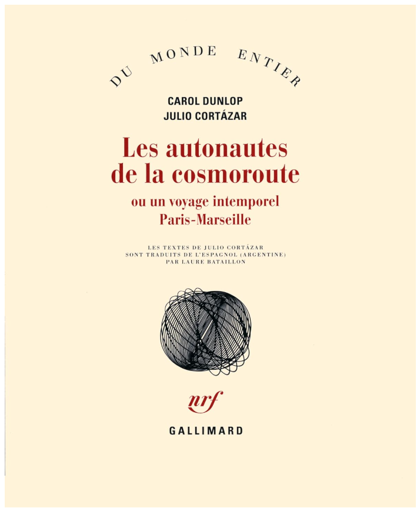
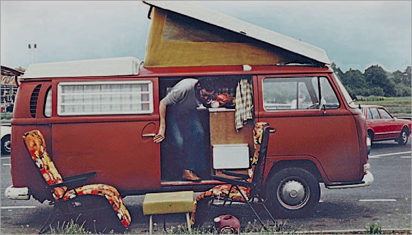
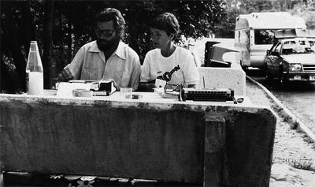
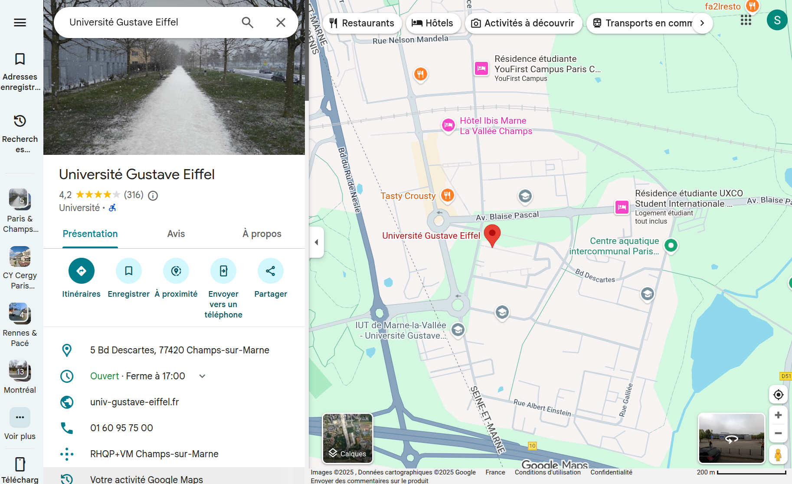
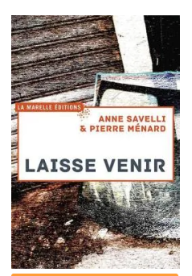

## Dans le mauvais sens 

#### Lectures & interprétations tactiques de la cartographie numérique

<!-- .element: style="width:600px" -->

%%%%%%%%%%%%%%%%%%%%%%%%%%%%%%%%%%%%%%%%%%%%%

## [1] Le sens du média 

#### ... et la production de l'espace

<!-- .element: style="width:300px" -->

===

D'où je parle ? 
Du Canada, de l'intermédialité. Étude des médias = ce qui est entre, ce qui sert d'environnement support pour transmettre un contenu d'un émetteur à un destinataire. Normalement, un média doit se faire transparent, afin de ne pas parasiter le message qu'il transporte. Si vous avez un mauvais réseau téléphonique, vous entendez mal la personne qui vous appelle, la communication est compromise. 

Les _media studies_, l'intermédialité, s'intéresse justement à ce "bruit" qu'on prend pour un bug, pour un raté de la médiation : nous, intermédialistes, nous sommes des chasseurs de bruits, des révélateurs de bruits médiatiques. Grâce au bruit, nous cherchons à comprendre ce qui dans le média, relève d'un impensé : ce qui s'est fait tellement transparent que l'on ne s'aperçoit même plus que nous sommes sous une certaine influence. 

Ce que nous adorons, nous intermédialistes, ce sont les oeuvres littéraires, picturales, ciné, etc. qui travaillent avec ces bruits, voire qui provoquent du bruit. 

§§§§§§§§§§§§§§§§§§§§§§§§§§§§§§§§§§§§§§§§§§§§§
<!-- .slide: data-background-image="img/Les_Autonautes_de_la_cosmoroute.jpg" data-background-size="contain"-->

*Les Autonautes de la Cosmoroute, Un voyage intemporel Paris-Marseille*, Claire Dunlop et Julio Cortazar (1983)

<!-- .element: style="width:45%;float:left;margin-left:-1em; font-size:1.4rem; text-align:right" -->

<!-- .element: style="width:50%;float:right;margin-right:-1em;" -->

===

Je voudrais, avant de vous parler de carte numérique, vous présenter une oeuvre qui va rendre un peu plus concrète mon approche, mais également le sujet dont on va parler aujourd'hui. Cette oeuvre = Les Autonautes de la cosmoroute.

Un jour de mai 1982, Julio Cortázar et sa compagne Carol Dunlop prennent l’autoroute du Sud en direction de Marseille. C’est le début d’une aventure et d’un jeu merveilleux, à la limite de la légalité, qui se déroulent pendant trente-deux jours sur l’A6.

Les deux explorateurs de l’autoroute à bord de leur vieux combi Volkswagen rebaptisé Fafner, en hommage au légendaire dragon de Wagner, tiennent un journal de bord détaillé où ils décrivent non seulement tous les aléas de leur périple Paris-Marseille, depuis la faune, la flore des aires de parking jusqu’aux toilettes pour dames en passant par ces « renforts gastronomiques et moraux communément appelés restaurants. »

§§§§§§§§§§§§§§§§§§§§§§§§§§§§§§§§§§§§§§§§§§§§§

### Qu'est-ce qu'un espace ?
* Un emplacement + une relation entre des objets = l'espace symbolique (Foucault, « Des espaces autres »)
* L'espace est une construction médiatique : le train, l'avion, les techniques cartographiques transforment notre façon de l'"habiter" et de le concevoir
* L'espace est aussi une construction discursive et donc littéraire (récits de voyage, etc.)

<!-- .element: style="width:45%;float:left;margin-left:-1em; font-size:1.4rem; text-align:left" -->

<!-- .element: style="width:50%;float:right;margin-right:-1em;" -->

===

Le média en jeu, dans cette expérience, n'est pas la littérature. Il est bien sûr question de littérature, mais ce n'est pas le plus important. Le média en jeu ici, c'est l'autoroute. Alors vous me direz qu'une autoroute ne correspond pas vraiment à l'image que vous vous faites d'un média. Je vous comprends. Mais si vous y réfléchissez bien, une autoroute, c'est un environnement-support, qui permet de transporter du contenu (vous, des marchandises) depuis un émetteur vers un destinataire.

Ce que l'on appelle ainsi "l'espace", en ayant tendance à le considérer comme une réalité objective, est en fait une construction, un concept, qui n'a cessé d'évoluer au cours du temps. 

Dans son texte « Des espaces autres » (1984), Foucault explique que, dans les sociétés modernes et
contemporaines, l'espace a été pensé comme emplacement, soit comme l’ensemble des relations entre
des objets. Ces relations peuvent porter des valeurs : l’espace est donc symbolique.

Pour comprendre l'espace, il faut ainsi admettre qu'il est un ensemble de structures discursives et non discursives intriquées.

En d'autres termes, l’espace est quelque chose que l’on peut produire (Henri Lefèvre), et s’il est composé d’un
mélange de structures symboliques et non symboliques, alors la littérature peut avoir une fonction de
production de l’espace.

On comprend mieux dès lors comment les récits de voyage en particulier ont participé à construire l'espace en produisant des discours et des contre-discours pour critiquer certains paradigmes dominants. On comprend aussi pourquoi les cartes, sous leurs faux airs de représentations objectives de territoire, sont elles aussi des constructions qui vont façonner nos imaginaires des territoires et nos façons de les habiter.

§§§§§§§§§§§§§§§§§§§§§§§§§§§§§§§§§§§§§§§§§§§§§

## Le non-lieu autoroutier
* L'autoroute : un espace traversable, non-habitable
* Une infrastructure aux valeurs capitalistes (circulation rapide des marchandises et des personnes)

<!-- .element: style="width:45%;float:left;margin-left:-1em; font-size:1.4rem; text-align:left" -->

<!-- .element: style="width:50%;float:right;margin-right:-1em;" -->

===
Pendant la deuxième moitié du XXe siècle par exemple, la construction massive d'autoroutes a illustré la volonté de produire un espace traversable, où pouvaient passer rapidement des marchandises et des personnes. L'autoroute n'est pas faite pour être habitée : elle est faite pour aller vite d'un espace à un autre. C'est aussi ce qu'on a appelé avec Marc Augé un non-lieu.

C’est le sens même de cette infrastructure et de ses valeurs associées que contestèrent en 1982 Julio Cortázar et Carole Dunlop, dans un road trip préoccupé par une réflexion sur
les enjeux politiques de la construction spatiale.

§§§§§§§§§§§§§§§§§§§§§§§§§§§§§§§§§§§§§§§§§§§§§

>"Avec ma femme, Carol Dunlop, également écrivain, nous envisageons une ‘expédition’ un peu folle et pas mal surréaliste, qui consisterait à parcourir l’autoroute à entre Paris et Marseille à bord de notre Volkswagen Combi, équipée de tout le nécessaire, en nous arrêtant sur les 65 parkings de l’autoroute à raison de deux par jour, c’est-à-dire en mettant un peu plus d’un mois pour faire le trajet Paris-Marseille, sans quitter jamais l’autorouteé."

<!-- .element: style="font-size:1.5rem; text-align:justify" -->

Julio Cortazar, Courrier à la Société autoroutière de France (resté sans réponse).

<!-- .element: style="font-size:1.5rem; text-align:justify" -->

===
Dans Les Autonautes de la cosmoroute (Cortázar et Dunlop, 1983), le couple d’écrivains fit le voyage Paris-Marseille sans jamais quitter l’A6, en faisant des haltes à chaque aire de voyage (près de 75).

L'autoroute est faite pour aller vite ? Et bien eux, ils vont y rester 2 mois.

§§§§§§§§§§§§§§§§§§§§§§§§§§§§§§§§§§§§§§§§§§§§§

## La cosmoroute : habiter le non-lieu
* Souligner la singularité d'espaces dits "interchangeables"
* Écriture de l'espace = écriture comme architecture, aménagement, construction

<!-- .element: style="width:45%;float:left;margin-left:-1em; font-size:1.4rem; text-align:left" -->

<!-- .element: style="width:50%;float:right;margin-right:-1em;" -->

===

Leur expérience avait pour objectif de détourner le sens premier de cette infrastructure : la vitesse et la rapidité. Dunlop et Cortázar modifièrent ainsi
profondément le sens de l'espace autoroutier, torpillant de l’intérieur ses objectifs et ses valeurs, et firent la démonstration de la singularité de ces non-lieux pourtant définis comme interchangeables (Augé,
1992).

§§§§§§§§§§§§§§§§§§§§§§§§§§§§§§§§§§§§§§§§§§§§§
<!-- .slide: data-background-image="img/cortazarcaroldunlop-8a320.jpg" data-background-size="contain" -->

===

Julio et Carol sont malades, ils sont condamnés. Le temps leur est compté, alors quoi de plus logique pour défier le temps si court qu'il leur reste que d'aller squatter, occuper un espace conçu pour n'être que traversé le plus rapidement possible. 

§§§§§§§§§§§§§§§§§§§§§§§§§§§§§§§§§§§§§§§§§§§§§

## Les autonautes : le voyage infini

>Tout comme je lui dois le meilleur de mes dernières années, je lui dois de finir seul ce récit. Je sais bien Oursine, que tu aurais fait la même chose si c’était moi qui avais dû partir le premier et je sais que ta main écrit, unie à la mienne, ces derniers mots où la douleur n’est pas, ne sera jamais plus forte que la vie que tu m’as appris à vivre, comme nous sommes peut-être arrivés à le montrer dans cette aventure qui parvient ici à son terme mais qui continue, continue dans notre Dragon, continue à jamais sur notre autoroute.

<!-- .element: style="font-size:1.5rem; text-align:justify" -->

===

On comprend lentement que ce voyage Paris-Marseille en fait est un adieu au monde, ce que Julio Cortázar, qui mourra peu de temps après sa femme, explique avec émotion dans le post-scriptum du livre :

« Tout comme je lui dois le meilleur de mes dernières années, je lui dois de finir seul ce récit. Je sais bien Oursine, que tu aurais fait la même chose si c’était moi qui avais dû partir le premier et je sais que ta main écrit, unie à la mienne, ces derniers mots où la douleur n’est pas, ne sera jamais plus forte que la vie que tu m’as appris à vivre, comme nous sommes peut-être arrivés à le montrer dans cette aventure qui parvient ici à son terme mais qui continue, continue dans notre Dragon, continue à jamais sur notre autoroute. »

§§§§§§§§§§§§§§§§§§§§§§§§§§§§§§§§§§§§§§§§§§§§§

### L'écriture comme cheval de Troie
* Occuper les medias / médias pour mieux détourner leurs fonctions
* Un [h]activisme médiatique au croisement du politique et de la parodie
* Un usage "tactique" des media

<!-- .element: style="width:45%;float:left;margin-left:-1em; font-size:1.4rem; text-align:left" -->

<!-- .element: style="width:50%;float:right;margin-right:-1em;" -->

===

Leçon = l'écriture comme cheval de Troie, travail d'infiltration littéraire des grands médias pour questionner le sens de ces outils que l'on utilise à toutes fins "utiles", "pratiques" et fonctionnelles, mais dont le message s'est immiscé en nous, dont nous avons fini par intégrer les valeurs implicites comme si c'étaient les nôtres. 

§§§§§§§§§§§§§§§§§§§§§§§§§§§§§§§§§§§§§§§§§§§§§

### Changer de sens, avec la théorie des *tactical media*
* *The ABC of Tactical Media*, Lovink et Garcia (1996-1997)
* Des pratiques à la croisée de l'art, de la théorie critique, de la technologie, et de l'activisme politique
* Des usages détournés de formes instituées : aspect ludique
* Une pratique populaire et amateur

===

Médias tactiques désigne une forme d'activisme dans les médias, qui pratique des interventions temporaires et localisées dans les médias, en tirant parti des faiblesses des systèmes médiatiques et des possibilités ouvertes par diverses technologies. C'est la traduction française du terme anglais Tactical media, forgé en 1996. Les médias tactiques critiquent l'ordre social ou économique dominant, et comportent souvent un élément humoristique ou satirique.

§§§§§§§§§§§§§§§§§§§§§§§§§§§§§§§§§§§§§§§§§§§§§

## Les questions à se poser 
* À quoi servent les medias spatiaux ? Doivent-ils être forcément utiles ?
* Quelles sont les valeurs symboliques des [nouvelles] mediations de l'espace ?
* Peut-on infiltrer et détourner un media ?
* Peut-on changer le sens d'un media ?

<!-- .element: style="width:45%;float:left;margin-left:-1em; font-size:1.4rem; text-align:left" -->

<!-- .element: style="width:50%;float:right;margin-right:-1em;" -->

===

%%%%%%%%%%%%%%%%%%%%%%%%%%%%%%%%%%%%%%%%%%%%%

## [2] Le sens de la carte 

### ... et de la médiation numérique de l'espace

<!-- .element: style="width:600px" -->

===

§§§§§§§§§§§§§§§§§§§§§§§§§§§§§§§§§§§§§§§§§§§§§
<!-- .slide: data-background-image="img/Gearth.png" data-background-size="contain"-->

Interface Google Earth (2010)

<!-- .element: class="source" -->

===

Les technologies numériques nous ont offert de nouveaux outils pour habiter et concevoir le territoire, pour y circuler, pour nous y repérer. Je dis « les techno numériques », mais je pourrais plus particulièrement dire Google, puisque parmi ces outils de visualisation du territoire les plus célèbres et les plus couramment utilisés, nous retrouvons Google Maps, Google Earth, et bien entendu Google Street View, qui a révolutionné notre quotidien en combinant la cartographie à l’image photographique. En dépit de leur aspect fort spectaculaire, ces dispositifs ne sont nullement l’invention des technologies numériques — dont les potentialités techniques ont cependant décuplé le rendu final. 

§§§§§§§§§§§§§§§§§§§§§§§§§§§§§§§§§§§§§§§§§§§§§
<!-- .slide: data-background-image="img/great_globe-22876.png" data-background-size="contain"-->

*Great Globe* de James Wyld (Londres, 1851).

<!-- .element: class="source" -->

===

Au dix-neuvième siècle déjà, les panoramas et les géoramas offraient au spectateur une position omnisciente, nourrissant le fantasme d’une représentation à l’échelle 1:1 de la Terre. 

§§§§§§§§§§§§§§§§§§§§§§§§§§§§§§§§§§§§§§§§§§§§§
<!-- .slide: data-background-image="img/SP1224_13.png" data-background-size="contain"-->

Google - street view Trek

<!-- .element: class="source" -->

===

C’est d’ailleurs en répondant à ce vieux fantasme que Google assure la promotion de son service : « Découvrez des sites connus dans le monde entier et des merveilles naturelles, et visitez comme si vous y étiez des musées, des stades, des restaurants, des commerces et des petites entreprises, grâce aux images à 360 degrés de Google Maps avec Street View14 ».

En s’appuyant sur le fantasme d’une représentation du monde la plus exacte possible, Google le passage d’une représentation plane vers un dispositif d’immersion offrant des panoramas à 360 degrés, et ajoutent au tracé et à la toponyme du territoire (routes, reliefs, villes, rues, etc.) des images dans lesquelles l’internaute peut circuler au moyen de fonctions de travellings, mais aussi des informations sur les institutions, les restaurants et les magasins qu’il peut y croiser. Ce dispositif est lui-même alimenté par l’internaute, qui contribue à ajouter des images, à noter les établissements visités, etc.

Aussi, en dépit de leur fonction proprement pratique et cartographique, ne saurait-on sous-estimer l’influence des logiciels Street View et Google Earth dans la réinvention du paysage contemporain : tout comme il y a eu un paysage pictural, un paysage photographique, etc., Google est en train de façonner son propre paysage. 

Cette tendance est palpable à travers des projets tels que les « Street View Treks », qui proposent à l’internaute de grimper vers un camp de base de l’Everest, de partir en balade sur le long des canaux de Venise, d’explorer la forêt de Tanzanie. Google nous invite ainsi à « partir en trek », à « réveiller l’explorateur qui est en nous pour voyager à travers le monde sans quitter [n]otre fauteuil », depuis l’écran de notre ordinateur ou de notre tablette. À travers nos navigations, le programme propose finalement une forme inédite de tourisme, ouverte au plus grand nombre.

§§§§§§§§§§§§§§§§§§§§§§§§§§§§§§§§§§§§§§§§§§§§§
<!-- .slide: data-background-image="img/universite-Gustave-Eiffel.png" data-background-size="contain"-->

===

Auparavant, une carte imprimée n'était qu'une représentation statique de la ville, désormais la carte numérique est immersive, étroitement associée à une combinaison de différents médias, réactive à nos appareils : si je bouge avec mon téléphone, alors la carte bouge avec moi. 

Expérience avec votre fac. Il neige...

§§§§§§§§§§§§§§§§§§§§§§§§§§§§§§§§§§§§§§§§§§§§§
<!-- .slide: data-background-image="img/universite_Gustave_eiffel.png" data-background-size="contain"-->

===

Le fantastique outil de Google Maps, qui nous permet de ne plus jamais nous perdre, a agrégé une série d'informations qui ne relèvent plus seulement de la simple cartographie :
  - des adresses de magasins
  - des adresses de restaurants
Toutes ces adresses font l'objet d'une évaluation et de commentaires. 

§§§§§§§§§§§§§§§§§§§§§§§§§§§§§§§§§§§§§§§§§§§§§
<!-- .slide: data-background-image="img/universite_gustave_eiffel-avis.png" data-background-size="contain"-->

===

"intelligente" ou "augmentée" : elle donne une série d'information en temps réel ; elle est immersive, participative, interactive : je peux réagir et partager mon expérience avec les autres pour modifier des éléments de la carte.

La carte de la ville s'est aujourd'hui superposée à toute une série d'information, d'évaluations, de services, qui exercent une influence directe sur les comportements des usagers. Je peux décider de modifier mon chemin pour éviter une rue trop encombrée. Je vais préférer la pizzeria notée 4,3\* plutôt que le resto de sushi noté 2,5\*, même si je préfère les sushis (et l'on comprend que déjà une influence s'opère), uniquement parce que je me fie à la note qui a été donnée par mes pairs.

§§§§§§§§§§§§§§§§§§§§§§§§§§§§§§§§§§§§§§§§§§§§§
<!-- .slide: data-background-image="img/universite-Gustave-food-court.png" data-background-size="contain"-->

===

Mais aussi une écriture plus insidieuse et inconsciente : écriture des données.

On peut connaître aussi l'achalandage en fonction des heures. Tant et si bien que lorsque je décide, par exemple, de me promener dans le quartier de la Sorbonne, je vais avoir en même temps une série de suggestions de cafés où me rendre : c'est une façon de faire de la publicité - ou plus précisément pour reprendre un autre terme est souvent avancé dans le domaine des économies numérique : c'est une manière d'exercer une influence...

Tout cela pour dire que si la question de la structuration du web est aussi problématique, c'est parce qu'elle structure en fait le réel. Elle a un impact effectif sur notre monde et notre manière de l'habiter, d'y vivre.

§§§§§§§§§§§§§§§§§§§§§§§§§§§§§§§§§§§§§§§§§§§§§

Quelques initiatives tactiques de détournement de l'espace numérique

§§§§§§§§§§§§§§§§§§§§§§§§§§§§§§§§§§§§§§§§§§§§§
<!-- .slide: data-background-image="img/postcardsvalla-35d9b.jpg" data-background-size="contain"-->

Clément Valla, *Postcard from Google Earth*, 2010-ongoing

<!-- .element: class="source" -->

===

Heureusement pour nous, le logiciel a parfois des ratés, ou des effets d'étrangetés. Chez l'artiste français Clément Valla, le bug de la représentation 3D/2D fait l'objet de captation systématiques, republiées par la suite.

§§§§§§§§§§§§§§§§§§§§§§§§§§§§§§§§§§§§§§§§§§§§§
<!-- .slide: data-background-image="img/tumblr_8483e93c5e357b7fbdeed682f2e8a204_dad7e0ee_1280.jpg" data-background-size="contain"-->

Jon Rafman, *9 eyes*, 2008-ongoing

<!-- .element: class="source" -->

===

Chez le Canadien Jon Rafman, les paysage de Street View -- parfois inquiétant, souvent drôles, d'autres fois sublimes -- sont également capté et imprimés pour devenir des tableaux.

§§§§§§§§§§§§§§§§§§§§§§§§§§§§§§§§§§§§§§§§§§§§§

<!-- .slide: data-background-video="img/YTDown.com_YouTube_Laisse-venir-un-livre-numerique-d-Anne-S_Media_w4-zgjRoP3c_001_1080p.mp4" -->

===

§§§§§§§§§§§§§§§§§§§§§§§§§§§§§§§§§§§§§§§§§§§§§

>Google Street View est un révélateur de notre expérience du monde et de notre rapport au temps, et en particulier de la paradoxale tension entre notre indifférence quotidienne aux choses qui nous entourent, et notre incessante recherche de connexion et d’interaction. C’est l’occasion de porter sur Google et le monde qu’il dessine, un nécessaire regard critique, une analyse de la représentation du monde que nous proposent Google Maps, Google Earth et Google Street View.  Ménard et Savelli 2015

<!-- .element: style="width:45%;float:left;margin-left:-1em; font-size:1.4rem; text-align:left" -->

<!-- .element: style="width:40%;float:right;margin-right:-1em;" -->

===

Les écrivains ne sont pas en reste : ils ont été nombreux ces dernières années à investir les logiciels cartographiques de Google pour en faire des embrayeurs fictionnels et mémoriels, tandis que dans le même temps ces logiciels influençaient le travail formel d’écriture. Outre le projet Traque Traces de Cécile Portier (qui utilise surtout, nous l’avons vu, Google Maps et Street View), nous pourrions notamment citer Une traversée de Buffalo de François Bon (voir Bon 2013) (Google Earth), Programme sensible d’Anne-Marie Garat (Google Earth et Street View), Un mage en été d’Olivier Cadiot (Google Earth), le projet collectif Un tour du jour en 80 mondes17 (Google Street View), ou encore Laisse venir, un ouvrage écrit à quatre mains par Pierre Ménard et Anne Savelli à partir de Street View, sur lequel nous porterons enfin notre attention.

Dans Laisse venir, Anne Savelli et Pierre Ménard ont décidé de prendre au mot l’invitation au voyage lancée par Google, à travers un projet littéraire en deux temps — ou même en trois temps, on le verra. Sur Street View, Anne Savelli et Pierre Ménard effectuent d’abord chacun de leur côté le trajet Paris-Marseille. Ce voyage « virtuel » est par la suite effectué en train dans le monde dit « réel ». Laisse venir constitue le récit de ce double voyage illustré de captures d’écran de Street View, dans lequel les deux écrivains nourrissent l’ambition de se réapproprier les lieux, les villes, en exploitant le potentiel onirique, esthétique et poétique du service cartographique, dont la fonction référentielle sera désormais reléguée au second plan :

>Google Street View est un révélateur de notre expérience du monde et de notre rapport au temps, et en particulier de la paradoxale tension entre notre indifférence quotidienne aux choses qui nous entourent, et notre incessante recherche de connexion et d’interaction. C’est l’occasion de porter sur Google et le monde qu’il dessine, un nécessaire regard critique, une analyse de la représentation du monde que nous proposent Google Maps, Google Earth et Google Street View (Ménard et Savelli 2015).

L’usage du terme « révélateur », avec ses connotations photographiques suggérant l’idée de faire apparaître l’invisible, ou plus exactement le latent, est ici essentiel : alors que Street View assure la promotion de son dispositif immersif en promettant une expérience qui adhère au réel — cherchant à faire oublier le médium de la représentation — les écrivains vont plutôt chercher à se heurter à l’image, questionnant sans cesse sa (prétendue) transparence. 

En s’opposant à l’aspect objectivant de la carte en images de Google, Pierre Ménard et Anne Savelli proposent une tout autre conception de l’espace, redéfini en termes de temps, d’histoire, et surtout des histoires de ceux qui l’habitent. Ils dynamitent le certificat d’authenticité que l’on voudrait lui voir conférer (à tort) par la photographie, afin de lui réinjecter les récits et les discours qui composent le réel.

§§§§§§§§§§§§§§§§§§§§§§§§§§§§§§§§§§§§§§§§§§§§§

>Il y a ce que je photographie et ce que j’écris. J’essaye d’écrire à la vitesse des images.

<!-- .element: style="font-size:1.7rem; text-align:justify" -->

===

Le récit de Pierre Ménard et Anne Savelli se construit à partir de ces trouvailles d’images déjà en « décalage » par rapport à leur fonction initiale, car elles ne font plus que montrer : elles surprennent, elles interrogent, elles posent problème — elles sont anamorphiques. C’est le cas des nombreux clichés de Street View où la présence des habitants se manifeste avec un peu trop d’insistance — dans ce cas, les visages floutés par souci de respect de la vie privée garantissent alors moins l’anonymat qu’ils n’ajoutent à l’étrangeté de l’image. Car dans cette expérience immersive, ce n’est déjà plus nous qui regardons l’image de la ville, mais la ville et ses habitants qui nous renvoient leur regard :

§§§§§§§§§§§§§§§§§§§§§§§§§§§§§§§§§§§§§§§§§§§§§

>Des postures.

<!-- .element: style="font-size:1.7rem; text-align:justify" -->

<!-- .element: style="width:600px" -->

§§§§§§§§§§§§§§§§§§§§§§§§§§§§§§§§§§§§§§§§§§§§§

>Des regards.

<!-- .element: style="font-size:1.7rem; text-align:justify" -->

<!-- .element: style="width:600px" -->

§§§§§§§§§§§§§§§§§§§§§§§§§§§§§§§§§§§§§§§§§§§§§

>Des silhouettes et des ombres.

<!-- .element: style="font-size:1.7rem; text-align:justify" -->

<!-- .element: style="width:600px" -->

§§§§§§§§§§§§§§§§§§§§§§§§§§§§§§§§§§§§§§§§§§§§§

>Une main tendue

<!-- .element: style="font-size:1.7rem; text-align:justify" -->

<!-- .element: style="width:600px" -->

§§§§§§§§§§§§§§§§§§§§§§§§§§§§§§§§§§§§§§§§§§§§§

>Une porte qui claque 

<!-- .element: style="font-size:1.7rem; text-align:justify" -->

<!-- .element: style="width:600px" -->

===

Le détournement de la fonction déictique des images de Street View repose de fait sur un renversement de la fonction référentielle attachée à l’imaginaire du médium photographique : une stratégie qui consiste, en quelque sorte, à faire image sur l’image, comme l’on parvenait à « faire fiction » un peu plus tôt. Elle devient donc une forme d’éditorialisation, en ce qu’elle engage une dynamique permettant la conception de l’espace.

§§§§§§§§§§§§§§§§§§§§§§§§§§§§§§§§§§§§§§§§§§§§§

>Et sur la place du Capitole, un moment d’absence, à un endroit très précis, comme une porte invisible dans l’espace, l’image se trouble de l’autre côté du miroir

<!-- .element: style="font-size:1.7rem; text-align:justify" -->

<!-- .element: style="width:600px" -->

===

 Le caractère fictionnel de la photo — conçue comme une construction et non comme un enregistrement — est ainsi révélé à travers les bogues du programme :

>Et sur la place du Capitole, un moment d’absence, à un endroit très précis, comme une porte invisible dans l’espace, l’image se trouble de l’autre côté du miroir

Expérience esthétique à part entière, le voyage via Street View est ainsi une expérience du vertige, produite par les déplacements à l’image et dans l’image (travellings optiques, zooms) qui imprègnent le processus de création.

Comme A. Savelli et Pierre MÉnard, la plupart des artistes et des écrivains qui vont écrire avec Street view cherchent à convoquer, à provoquer des images qui excèdent la fonction purement cartographique ou référentielle. 

Après avoir mis l’accent, dans les années 1990, sur la distinction entre réel et virtuel, les
études consacrées au fait numérique ont plutôt cherché ces dernières années à mettre en évidence la fusion, ou l’hybridation, des espaces numériques et non numériques (Floridi,
2014 ; Vitali-Rosati, 2016). Ce que récusent ces travaux, ce sont en particulier les connotations et les valeurs associées à cette distinction ontologique, qui semblent porter à croire que tout ce qui se manifeste à l’écran est moins réel, moins
vrai que ce qui existe en dehors de nos écrans. La structure anamorphique que nous proposons refuse elle aussi ce préjugé, à ceci près que le chevauchement qu’elle met en évi-
dence n’est pas tout à fait une fusion – laquelle donnerait lieu à un résultat homogène et consensuel – mais plutôt la démonstration d’une dimension multiple, hétérogène (soit,
parfois, contradictoire et conflictuelle) des choses. Cette dimension multiple ne se laisserait saisir qu’au prix d’un démontage, d’une prise de vue aberrante, comme un tableau
cubiste pourrait par exemple le proposer. L’anamorphose, en ce sens, n’essaie nullement de réconcilier ou de résoudre la problématique ontologique traditionnelle ; elle propose tout
simplement un modèle conceptuel où cette problématique n’a plus lieu d’être.

%%%%%%%%%%%%%%%%%%%%%%%%%%%%%%%%%%%%%%%%%%%%%

## [3] Le sens de la vue 
#### ... reconfiguré par les médias numériques

<!-- .element: style="width:400px" -->

===

La relation photolittéraire à creuser ici est celle de la relation entre l'idée du voir (qu'est-ce qu'une image donne à voir), et du savoir (qu'est-ce qu'une image donne à comprendre du réel) ?

§§§§§§§§§§§§§§§§§§§§§§§§§§§§§§§§§§§§§§§§§§§§§

La vue n'est pas un sens qui serait inné ou objectif. Il s'agit d'un sens qui s'aquiert et qui s'éduque. Or dans cette éducation, les médias de la représentation ont un rôle important à jouer. 

<!-- .element: style="font-size:1.7rem; text-align:justify" -->

===

DIsons-le de suite : dans notre conception, la vue n'est pas un sens qui serait inné ou objectif. Il s'agit d'un sens qui s'aquiert et qui s'éduque. Or dans cette éducation, les média de la représentation ont un rôle important à jouer. 

Qui parmi nous n'a jamais été surpris par le côté vieillot d'images captée par une technologie qui, il y a quelques décénnies ou même quelques années à peine, passaient pour des techniques de capation de pointe ? 

Si la relation qui unit depuis toujours voir et savoir avait déjà subi une transformation lors de l’invention de la photographie (Wicky, 2015), les mutations du regard à l’ère numérique ont à leur tour de lourdes conséquences épistémologiques et ontologiques. 

Voir n’a plus tout à fait la même signification qu’avant, et notre manière de concevoir le réel s’en trouve à son tour affectée.

§§§§§§§§§§§§§§§§§§§§§§§§§§§§§§§§§§§§§§§§§§§§§

### Changer de perspective

§§§§§§§§§§§§§§§§§§§§§§§§§§§§§§§§§§§§§§§§§§§§§
<!-- .slide: data-background-image="img/holbein.jpeg" data-background-size="contain"-->

source image : Holbein, *Les ambassadeurs*, 1533.

<!-- .element: class="source" -->

===

Qu’est-ce que l’anamorphose en premier lieu ?
Procédé pictural bien connu, l’anamorphose désigne littéralement une « forme qui revient », c’est-à-dire une déformation réversible (souvent, par la médiation d’un miroir, ou encore par le changement de point de vue du spectateur). Le principe anamorphique est ancien : dès l’antiquité, on savait déjà que l’harmonie des ensembles architecturaux dépendait d’une déformation des lignes, naturellement rétablie par l’œil humain. Cette aberration nécessaire à l’harmonie des formes est absolument essentielle à la notion d’anamorphose - puisqu’elle suppose déjà une relation complexe entre « bien voir » et « mal voir ».

Mais ces perspectives courbes ou « dépravées » selon l’expression de Jurgis Baltrušaitis, n’ont donné naissance au terme « anamorphose » qu’au XVIIe siècle. À la Renaissance, l’anamorphose transgresse les règles de la perspective pour cacher des images à l’intérieur d’autres images
En cachant un crâne anamorphique dans le tableau Les Ambassadeurs, Hobein menait une double transgression :
    1.  il encourageait le spectateur à rompre avec une conception figée de la représentation et avec un certain système hiérarchique mis en place par la perspective classique - je renvoie ici aux travaux de Panofky sur la question.
    2.  il encourageait le spectateur briser l’illusionnisme perspectif et à se réapproprier l’espace. Pour découvrir le sens du tableau, le spectateur devait littéralement le regarder dans l’autre sens, en opérant une sorte de transmédiation qui faisait pleinement interagir l’espace de la représentation de l’espace dit « réel ». Ces deux espaces devenaient de fait bien plus interdépendants.

§§§§§§§§§§§§§§§§§§§§§§§§§§§§§§§§§§§§§§§§§§§§§

### La navigation dans la carte comme figure de pensée et de style

>J’ai du mal à repérer certains endroits sur Google Earth sans vertige. Ils m’attirent, virtuellement parlant. Ils m’effraient réellement. Ces photos aériennes sont plus vieilles que la soirée où nous rompîmes. Le soir ne tombe pas encore, nous ne sommes pas encore rendus au Poliziano, la table est vide. Nous avons du retard, rien n’a encore eu lieu. Cet endroit n’existe pas. Je me demande à quelle fréquence les photos de Google Earth actualisent mon histoire. 

<!-- .element: style="font-size:1.7rem; text-align:justify" -->

Anne-Marie Garat, *Programme sensible*, 2013

<!-- .element: style="font-size:1.3rem; text-align:right" -->

===

La navigation dans la carte comme "forme symbolique"

>J’ai du mal à repérer certains endroits sur Google Earth sans vertige. Ils m’attirent, virtuellement parlant. Ils m’effraient réellement. Ces photos aériennes sont plus vieilles que la soirée où nous rompîmes. Le soir ne tombe pas encore, nous ne sommes pas encore rendus au Poliziano, la table est vide. Nous avons du retard, rien n’a encore eu lieu. Cet endroit n’existe pas. Je me demande à quelle fréquence les photos de Google Earth actualisent mon histoire 

§§§§§§§§§§§§§§§§§§§§§§§§§§§§§§§§§§§§§§§§§§§§§

>Cet endroit n’existe pas, ou bien pas encore. Son téléchargement est pénible, bas débit du flux de mémoire. J’ignore le nombre de conducteurs qui sérialisent la transmission, comme la fréquence bidirectionnelle ou non qui donne de l’information par à-coups, peine à agréger les bits en image haute définition, j’ai du mal à voir ce que je veux dire. Malgré ce que prétend Alix, impulsion et exécution ne sont pas synchrones. Ou bien ma lecture est trop lente, trop lent mon cerveau à occuper les zones allouées, les zones vierges où stocker cette séquence ; elle est si reculée dans le temps qu’elle le semble dans l’espace. Je cherche à la géolocaliser quand c’est dans le passé qu’elle se loge, dans des strates fossiles où je suis mort d’enfance. […] L’image s’exécute, illisible en l’état, antinarrative hors traduction, aucune carte n’en donne le tracé, nul récit. Les photos aériennes de Google Earth ignorent ces régions que les satellites survolent sans qu’aucun capteur enregistre leur existence, sauf le moutonnement égal d’un agrégat lunaire zoné par plaques insensibles, floutées par les nuages ou les loupes atmosphériques

<!-- .element: style="font-size:1.3rem; text-align:justify" -->

Anne-Marie Garat, *Programme sensible*, 2013

<!-- .element: style="font-size:1.3rem; text-align:right" -->

===

La mythologie du logiciel forge ainsi ses propres figures de style et de pensée. Google Earth, en particulier, produit une allégorie de la mémoire traumatisée de Jason, filant une métaphore informatique de l’anamnèse :

CITER

Les engourdissements de la mémoire, ses « blancs », s’apparentent alors aux bogues de téléchargement des images, qui peinent à se matérialiser à l’écran, de même que Jason s’embourbe dans son processus de remémoration.

Si ces nouvelles machines de vision affectent bel et bien notre regard, quel type de spectateur sommes-nous en train de devenir ?

Comme on l’a dit plus tôt, les « ratés » du logiciel génèrent, par un effet de sérendipité, des révélations. C’est ainsi que Jason, le personnage principal de Programme sensible, parviendra à finalement boucler son enquête et à découvrir l’horrible vérité sur le massacre de sa famille. Après avoir rapidement abandonné tout espoir de retrouver la trace de sa maison d’enfance sur Google Earth, Jason se laisse peu à peu entraîner dans la contemplation des abstractions du logiciel, attiré sous la surface de son écran dans une rêverie qui se meut en anamnèse :

§§§§§§§§§§§§§§§§§§§§§§§§§§§§§§§§§§§§§§§§§§§§§

Nul doute, en ce temps-là elle était gaie, douée pour les facéties et la photographie ; aujourd’hui il n’y a pas plus triste que tante Dee. Mais la voilà rajeunie par pur enchantement, lifting cervico-facial, ses traits s’égalisent, ses cheveux fourmillent de vers luisants, pas de doute, entre deux pans, elle me regarde. Je soutiens sans faillir ce regard sorti des ombres. Je suis petit, mais nous sommes à la même hauteur, nos visages sont en vis-à-vis, yeux dans les yeux je lui déclare : tu les as assassinés. Question subsidiaire : pourquoi pas moi ?

===

Avec ce même vertige temporel emprunté au logiciel, le visage ridé de Dee s’anamorphose et laisse réapparaître la beauté des traits de la jeune fille d’autrefois. Comme un écho du passé, Jason enfant vient prêter sa voix à l’adulte qu’il est devenu pour poser la question fatale : pourquoi, après avoir assassiné leur famille entière, l’avoir épargné lui ? Grâce à ce léger déplacement, Jason brise l’illusion du roman familial officiel de Dee : sa mémoire pétrifiée se ranime enfin, redevient mémoire vive.

§§§§§§§§§§§§§§§§§§§§§§§§§§§§§§§§§§§§§§§§§§§§§

Merci !